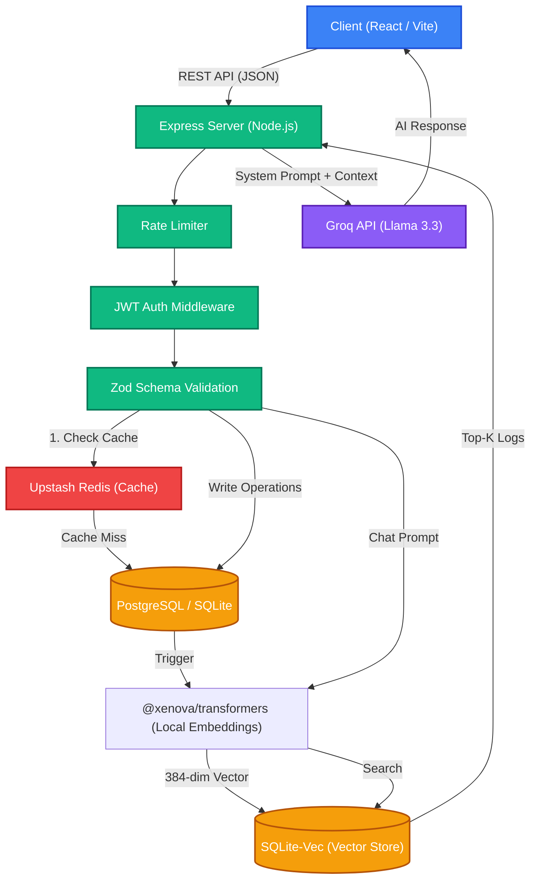

# VitalDiary System Architecture

This document outlines the high-level architecture of VitalDiary, demonstrating the flow of data across the client, backend, caching layer, and databases.

## High-Level Architecture Diagram

## Flow Description

1. **Client Interaction**: The user accesses the web application, built with React and Vite, interacting via standard RESTful JSON APIs.
2. **Security Perimeter**: Requests enter the Node.js Express server and immediately pass through `express-rate-limit` (abuse protection), `authenticateToken` (JWT validation & RBAC), and `validate` (Zod schema boundary).
3. **Caching Layer**: Read operations (`GET`) attempt to fetch data from Upstash Redis first. On a cache hit, the data is returned immediately. On a cache miss, data is queried from the primary database, cached for 5 minutes, and then returned. Write operations (`POST`, `PUT`, `DELETE`) invalidate the specific user's cache pattern to ensure data consistency.
4. **Primary Database**: Handles structured relational data and JSON fields. VitalDiary supports both SQLite (local development) and PostgreSQL (production).
5. **RAG Data Pipeline (Write)**: When medical records are created, updated, or deleted, a fire-and-forget hook invokes `@xenova/transformers` locally. The text is embedded into a 384-dimensional semantic vector and stored in `sqlite-vec`.
6. **AI Assistant Pipeline (Read)**: When the user asks a health question, their prompt is embedded locally. A cosine distance similarity search is executed against `sqlite-vec` to retrieve the top 5 most relevant historical logs. These logs are securely injected into the system prompt context window and sent to the Groq API (Llama 3.3) to generate a highly personalized, context-aware response.
